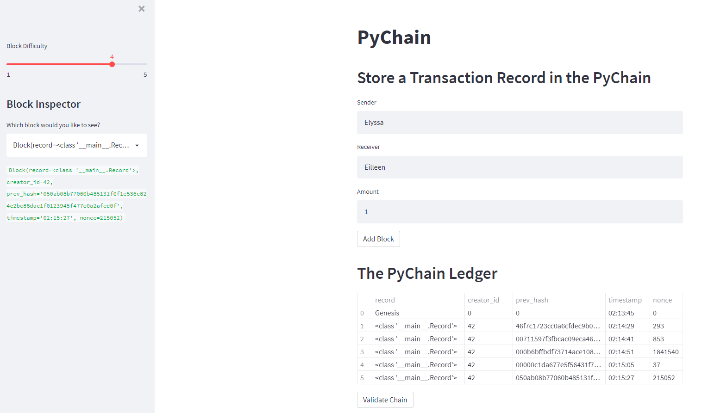
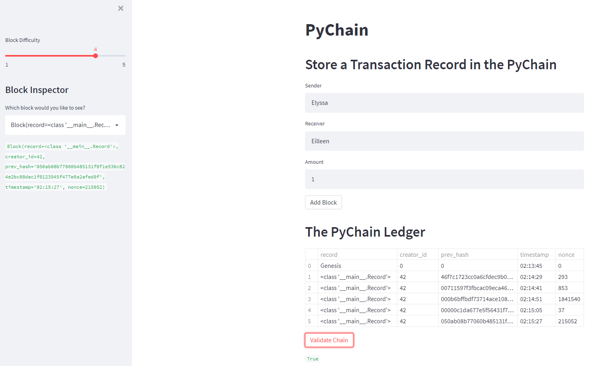

# Blockchain Ledger

## Streamlit Application
This application serves the purpose of creating and maintaining a blockhain ledger of transations.  The information needed to create each entry is the Sender and Receiver name, along with the amount that is changing hands for the transaction.  Once the information has been entered and the transaction added to the ledger, there will be a new line on the chart at the bottom that reveals certain information to maintain anonymity for those involved.  The information displayed is the transation amount, record, the previous transaction hash, the timestamp of the transation, as well as the nonce of each event.  Upon proper addition of transaction information, the application will produce a small celebration, confirming the successful addition of the transaction!  The screenshots below provide an insight to the functionality of the application.

-----

## Ledger Event Addition

In the above screenshot, the information for the Sender (Elyssa), the Receiver (Eilleen) and the transaction amount (1) have been added to the text input box.  This transaction has been given a block difficulty of 4 as shown on the slider on the application sidebar.  This occurrence is then appended to the end of the ledger in its proper anonymous format.

------
## Ledger Validation

This screenshot displays the ledger's ability for validation to show the correct information entered, ensuring a correct and continuous blockchain of events.  Utilizing the "Validate Chain" button, a "True" or "False" indicator will be displayed.  In this case, the events of the blockchain are valid, as shown by the green "True" indicator.